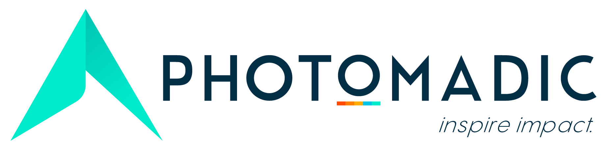

This repository contains all guidelines for the development team. This is meant
as a living document; contributions or changes are welcome and can be discussed
through the form of a Pull Request to this repository.

### Recommended reading

Our exact mix of culture and process are unique to us, but the principles are
taken from tried-and-true principles in use by other teams. While the goal of
these documents are to outline the most important components of our process, it
is not intended to be a comprehensive overview on the core subjects such as
Agile. The following are recommended for further reading as complementary to our
team's approach and more in-depth on some of the principles:

* [A successful GIT branching model](http://nvie.com/posts/a-successful-git-branching-model/)
* [Better Software and Stronger Teams](https://www.zenhub.com/github-project-management.pdf)
* [The Agile Samurai](https://www.amazon.com/Agile-Samurai-Masters-Deliver-Software/dp/1934356581)
