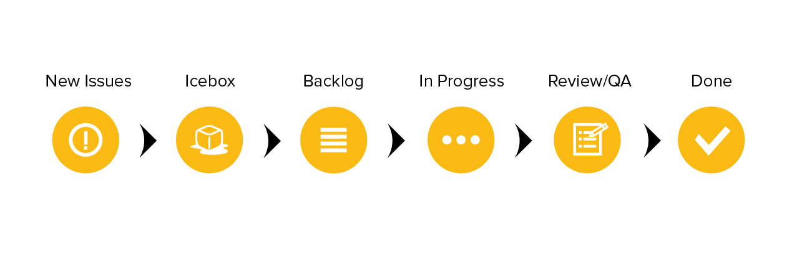

# Backlog

The backlog for each project is managed directly in GitHub. All stories are represented through [Issues](https://guides.github.com/features/issues/) and linked [Tasks](https://github.com/blog/1375-task-lists-in-gfm-issues-pulls-comments) in Github and are managed in task boards through Zenhub to better represent the stage of each story in the release cycle.

## Story types

Any development must have a corresponding story before work has begun on the implementation. This story can take the form of a feature, bug or chore.

* **Features** are vertical slices of functionality that delivery business value in the form of software. They represent a complete set of usable functionality and are sized according to their relative difficulty using a point value based on the fibonacci sequence. Typically stories that are sized at 13 points or higher should be broken into smaller slices if possible so long as they deliver a complete set of functionality.

* **Bugs** are any technical issue that exists with currently deployed features. Bugs can also represent refactoring required on existing code. Bugs cannot be created for features that are in progress as these should be included in the feature work itself. Bugs are not sized.

* **Chores** represent small updates to existing code that may otherwise be categorized as a feature but are too minor in nature. These can be textual updates, typos, or documentation.

Stories are categorized by Type and further grouped into Epics using [Labels](./LABELS.md) representing areas of the application or large feature-sets. [Milestones](https://help.github.com/articles/creating-and-editing-milestones-for-issues-and-pull-requests/) are used to track progress against sprints, releases and important dates to the business stakeholders.

An [Issue Template](../.github/ISSUE_TEMPLATE.md) has been included in this repository that can be used in GitHub for automatic population of a new Issue with the necessary fields for a fully defined bug and feature stories.

#### Features

Before work on a feature can begin, it must be thoroughly defined with at least the following:

* **Feature title** A feature title should include the common persona, requested feature, and a "so that" which describes the value this feature delivers to either the persona or the business: _"As a [user type], I want [a goal] so that [benefit]."_

* **Context** Context is one of the most important parts of the feature and should be sufficiently detailed so that anyone reviewing the story knows the "Why". This is not another format for specifications or requirements. Rather, it should help to explain both the motivation for creating the issue and what is a valuable _outcome_ for the user.

* **Requirements** Requirements are a bulleted list of details that are important to either the persona or the business in order for this feature to deliver value.

* **How to Demo** This section should contain step-by-step instructions on how to demo the feature to the business stakeholder. It is important to keep this section free of any technical descriptors or complexities. It should be as simple as "do this, expect that". The How to Demo also provides a great starting point for an End to End test to accompany the feature.

* **Tasks** The tasks sections serves as a checklist to the developer and should represent the steps necessary to implement the story. Tasks should be broken up sufficiently so that no one task takes longer than one day. Tasks can and should be more technical in nature and serve as a leading indicator to the progress made on the feature.

Unlike other elements of a story, the Tasks section can change as development
proceeds. If new tasks are identified or existing tasks are no longer needed due
to current realities, these can be edited by the developer assigned.

#### Bugs and Chores

Bugs and chores must have full definition before the story can be started, but do not require the same ceremony as a feature. Generally, they should have the following:

* **Requirements** For bugs this should include details on the user, operating system, and any other environment information that is specific to the bug being experienced. Bugs need to include both expected and actual results from a user perspective. Chores should clearly capture the requested change with as much detail as necessary for the developer to have a clear definition of done.

* **Steps to Reproduce** Specific to bugs, this represents the "How to Demo" for the fix. These steps when followed should result in the original bug being observed for diagnosis and testing during development. During demo following these steps should result in the expected behavior as outlined in the requirements.

## Workflow

All issues are moved between Pipelines representing their current stage within the development lifecycle. Currently, the following workflow is observed:

* **New Issues** New stories or issues are created here. Anyone from the team can create an Issue at any time with as little or as much information as is available at the time. Issues in this category should be triaged regularly by the team and either moved to the Icebox or de-prioritized completely.

* **Icebox** The Icebox generally represents items that are low priority in the backlog. Issues in this category should be populated with enough information on the story so that its purpose and business value are clear. Remember, some Icebox stories may stay in this category for a length of time before being prioritized.

* **Backlog** Stories in this pipeline are prioritized and ready for development. A story must be fully populated with all technical requirements and a task list before being moved out of the Icebox since work can begin on it at any time. See the [Issue Template](../.github/ISSUE_TEMPLATE.md) in the project repository for the full Definition of Ready.

* **In Progress** When a developer starts work on a story, it moves to the In Progress section. Each Issue in this pipeline should have an assigned owner who is responsible for its completion. If a team member decides to take on a task, they simply self-assign the Issue and move it to the In Progress column, instantly communicating to the rest of the team that the task is underway. Effort should be made to limit In Progress stories to one per team member, though exceptions can be made for blocked stories.

* **Review/QA** We use the Review/QA column for Issues that are open to the team for review and testing. An issue is moved to the Review column when a pull request has been made for the story within GitHub. This will run all automated QA process and deploy the feature to a staging server that can be reviewed at any time by the stakeholders.

* **Done** These issues have been accepted by the product owner or business stakeholder and no additional work is required. All code should meet the agreed-upon Definition of Done criteria and is awaiting final merge into the release branch.

* **Closed** Once an issue has been merged into the release branch it is closed. Additionally, issues may be closed immediately if it represents duplication of an existing story or work that has been completely de-prioritized.
