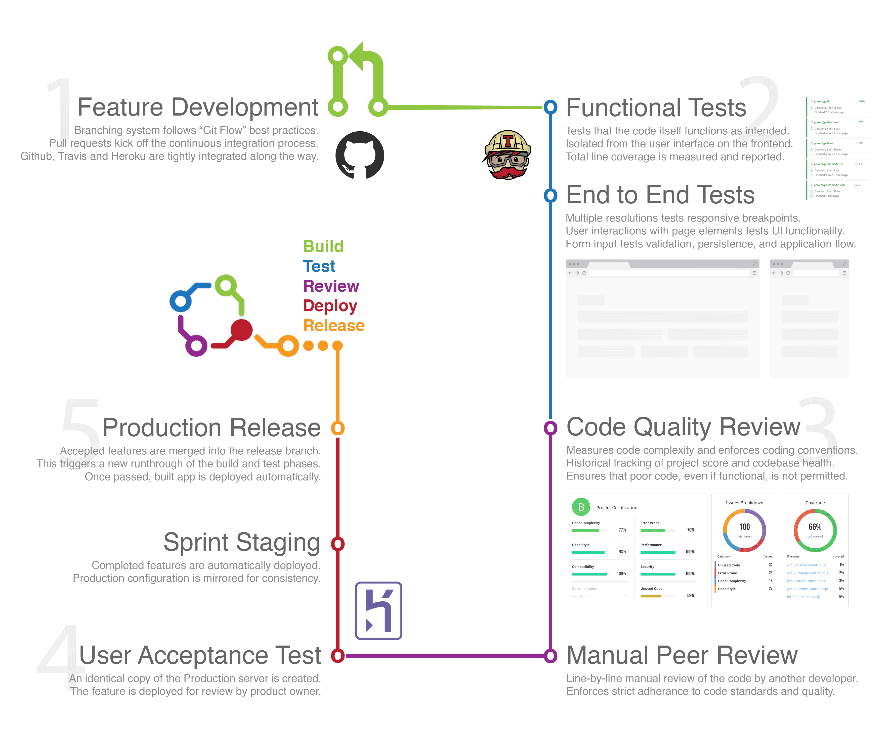

# Feature development

Feature development happens on independent branches using the Git Flow style of
branching and include both automated and manual tests before staging, review,
and final deployment. The following is a high level overview of the development
lifecycle on each feature:

1. Feature development begins by branching off the latest stable `development`
branch in GIT. Once finished, a pull request is created to signify completion.

2. Travis runs all functional unit tests and a suite of responsive browser-based
end to end tests and reports status in the pull request.

3. Static analysis is run on the newly committed code and reported in the pull
request. Meanwhile, a manual peer review of both the code and functionality is
conducted by another developer on the team.

4. During the manual review process, a UAT environment is automatically created
with the new feature deployed. After the feature is approved the code is merged
and deployed to Staging and the UAT environment is spun down.

5. Accepted features from the previous sprint are pushed to the release branch
which kicks off a final round of automated tests in Travis before building and
deploying the new release.

